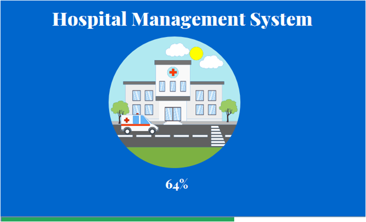
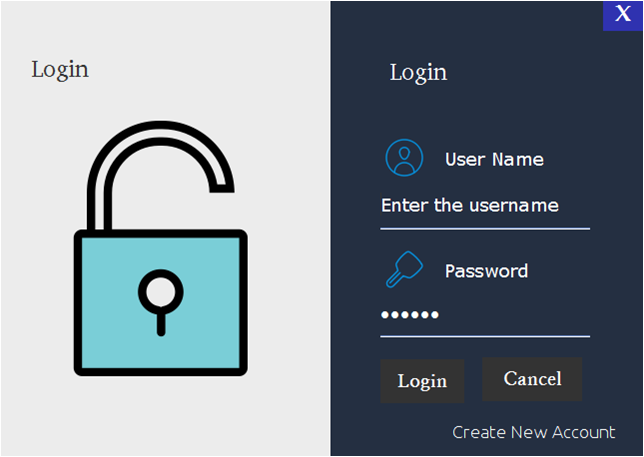
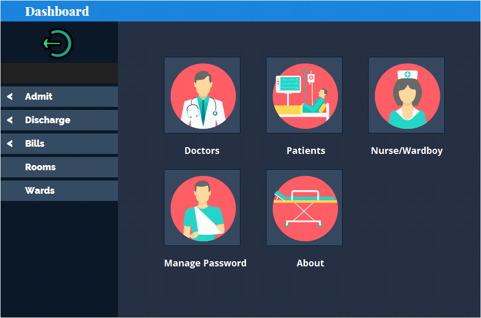

# Hospital Management System - Java

## A Java based desktop application mainly developed for administration purpose in hospitals that includes registration of patients ,storing their details into database and also computerized billing. 
* Frontend-Java
* Backend-MySql Server

### Splash Screen

### Login

### Dashboard

